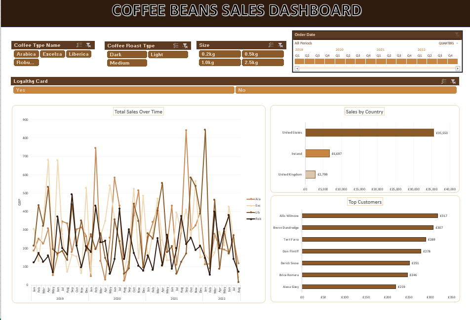

# Coffee-Beans-Sales-Dashboard
An interactive Excel Dashboard analysing coffee order data. 

**Data-analyst skills:** lookups, conditional logic, PivotTables, PivotCharts, and interactive filtering.

**Data Set:** - Repo

**Insight(s):** The United States drives roughly **79%** of total revenue - more than **5x** Ireland and UK combined.
**79%** of total revenue **(£35,550 of £45,046)**, far outweighing Ireland **(15%)** and the UK **(6%)**. Suggesting the business is heavily concentrated in a single market.

PS: Project concept and dataset - Mo Chen's Excel Portfolio Project.
