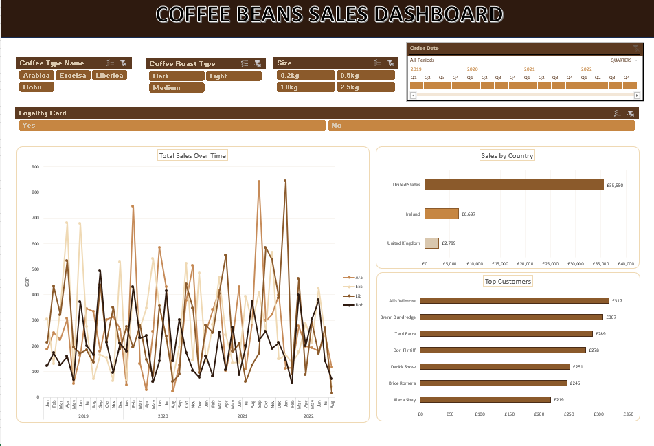
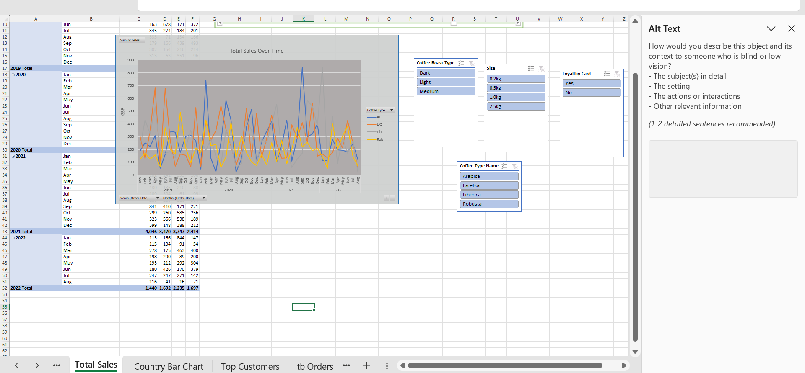

# Coffee-Beans-Sales-Dashboard

An interactive Excel dashboard that transforms raw coffee order data into live business metrics. This project demonstrates core data-analysis skills applied to a real sales dataset, complete with dynamic filtering and visualization.

Overview

Coffee sales data doesn't tell a story on its own—it needs to be organized, calculated, and presented clearly. This dashboard takes order records and surfaces the key numbers that matter: which countries are buying, how much revenue each generates, and where the business is concentrated.

The dashboard uses only native Excel tools: no VBA, no plugins, just formulas and PivotTables working together.

The Data
Orders across three countries: United States, Ireland, and United Kingdom
Total revenue: £45,046
Data spans multiple orders with customer, product, quantity, and date information
Two files included: raw data and analysis-ready dashboard
Dashboard Features

Interactive Elements

Filter by country, product type, and date range
Charts update automatically when filters change
Dynamic calculations refresh in real time

Techniques Used

Lookup formulas (VLOOKUP, INDEX/MATCH) to pull customer and product details
Conditional formatting to highlight key metrics
PivotTables to summarize sales by country and product
PivotCharts to visualize revenue distribution and trends
Named ranges for cleaner formula references
Key Finding

The United States dominates revenue generation, accounting for roughly 79% of all sales. The breakdown:

Country	Revenue	Percentage
United States	£35,550	79%
Ireland	£6,754	15%
United Kingdom	£2,742	6%

This concentration shows a heavily skewed market. While the US is clearly the revenue engine, it also highlights a business risk: over-reliance on a single geography means limited diversification.

Files
CoffeeBeansDashboard.xlsx - Interactive dashboard with charts, filters, and live metrics
RawDataCoffeeOrders.xlsx - Original order data
CDB.png - Screenshot of the dashboard
EXL.png - Screenshot of the data and formulas

VLOOKUP and INDEX/MATCH for cross-sheet data retrieval
IF statements and nested logic for conditional calculations
PivotTable design for flexible summarization
PivotChart configuration for dynamic visuals
Data validation for dropdown filters
Conditional formatting to highlight thresholds and outliers
Dataset Source

Notes
All revenue figures are in British pounds (£)
Dashboard assumes Excel 2016 or later for full compatibility
Filters are case-sensitive; data entry uses standard capitalization
PivotTables can be refreshed if source data is updated

**Insight(s):** 

The United States drives roughly **79%** of total revenue - more than **5x** Ireland and UK combined.
**79%** of total revenue **(£35,550 of £45,046)**, far outweighing Ireland **(15%)** and the UK **(6%)**. Suggesting the business is heavily concentrated in a single market.

----

